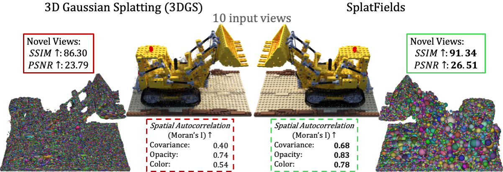

# SplatFields: Neural Gaussian Splats for Sparse 3D and 4D Reconstruction

[Project page](https://markomih.github.io/SplatFields/) | [Paper](https://arxiv.org/pdf/XXX.XXX) <br>



This repo contains the official implementation for the paper "SplatFields: Neural Gaussian Splats for Sparse 3D and 4D Reconstruction". 
SplatFields regularizes 3D Gaussian Splatting (3DGS) by predicting the splat features and locations via neural fields to improve the reconstruction under unconstrained sparse views. 

Our approach effectively handles static and dynamic scenes. 

## Installation
We tested on a server configured with Ubuntu 18.04, cuda 11.6 and gcc 9.4.0. Other similar configurations should also work, but we have not verified each one individually.

### 1. Clone this repo:

```bash
git clone https://github.com/markomih/SplatFields.git
cd SplatFields
```

### 2. Install dependencies

```bash
conda env create --file environment.yml
conda activate SplatFields
# install 3DGS renderer
pip3 install -e git+https://github.com/ingra14m/depth-diff-gaussian-rasterization@f2d8fa9921ea9a6cb9ac1c33a34ebd1b11510657#egg=diff_gaussian_rasterization
pip3 install -e git+https://gitlab.inria.fr/bkerbl/simple-knn.git@44f764299fa305faf6ec5ebd99939e0508331503#egg=simple_knn
pip3 install -e git+https://github.com/open-mmlab/mmgeneration@f6551e1d6ca24121d1f0a954c3b3ac15de6d302e#egg=mmgen
```

## Static Reconstruction
The project structure follows the origianl 3DGS repository. 

### Blender Dataset
To run SplatFields on the Blender dataset, download the origianl [NeRF synthetic dataset](https://drive.google.com/drive/folders/128yBriW1IG_3NJ5Rp7APSTZsJqdJdfc1) and follow the instructions in the `run_blender.sh` script. 

Make sure that the `DATASET_ROOT` variable is set to the directory where the Blender dataset is downloaded. 

### DTU Dataset
To run our method on the DTU dataset, you could directly download the pre-processed subset released in the [2DGS repo](https://drive.google.com/drive/folders/1SJFgt8qhQomHX55Q4xSvYE2C6-8tFll9). 
We provide the bash script `run_dtu.sh` to run SplatFields on the DTU sequences. Update the `DATASET_ROOT` in the script to the path of the downloaded dataset. 

## Dynamic Reconstruction
SplatFields straightforwardly extends to dynamic scenes. 

### Owlii Dataset
The pre-processed Owlii dataset for the dynamic sparse view reconstruction is available [here](https://drive.google.com/file/d/1OdqwXKmvnpxFI4LC8ckI0eV6r9EZ64ZV/view?usp=sharing) (or download it via `gdown 1OdqwXKmvnpxFI4LC8ckI0eV6r9EZ64ZV && unzip DATA_OWLII`). Then, run the script `run_owlii.sh` to train our model on varying configurations (set the data directory appropriately). 

## Citation

If you find our work helpful, please consider citing:
```bibtex
@inproceedings{SplatFields,
   title={SplatFields: Neural Gaussian Splats for Sparse 3D and 4D Reconstruction},
   author={Mihajlovic, Marko and Prokudin, Sergey and Tang, Siyu and Maier, Robert and Bogo, Federica and Tung, Tony and Boyer, Edmond},
   booktitle={European Conference on Computer Vision (ECCV)},
   year={2024},
   organization={Springer}
}
```

## LICENSE
The code released under this repo is under MIT license, however the origianl 3DGS renderer that is utilized has a more restrictive [LICENSE](https://github.com/graphdeco-inria/gaussian-splatting).
